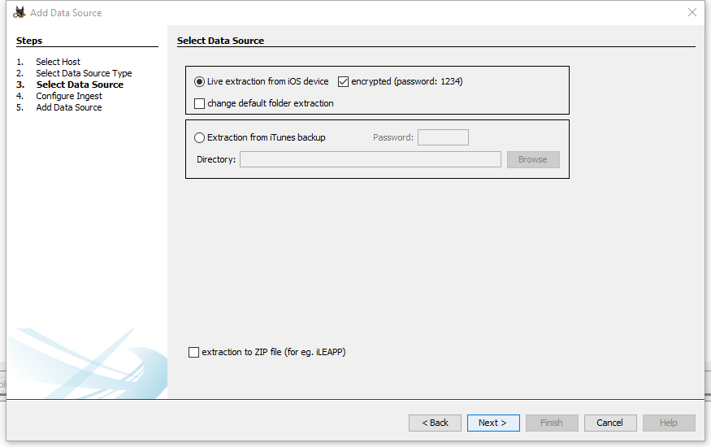

# iOS Device Data Extractor
Autopsy module that creates an encrypted or unencrypted iOS backup of iPhone or iPad and extracts files from them.

## Table of contents
* [General info](#general-info)
* [Screenshots](#screenshots)
* [Technologies](#technologies)
* [Setup](#setup)
* [Usage](#usage)
* [Inspiration](#inspiration)
* [Contact](#contact)

## General info
iOS Device Data Extractor is an Autopsy module that creates an encrypted or non-encrypted iOS backup of iPhone and iPad, currently running iOS 10.2 and above. It extracts files from an encrypted or unencrypted iOS backup, including a backup made with iTunes, and can compress them into a zip archive for use with the iLEAPP module, for example.

## Screenshots

## Technologies
* Windows 10 Home OS
* Linux Ubuntu 20.04 OS
* Autopsy - version 4.19.1
* Apache NetBeans IDE - version 12.2

## Setup
Installation:
1. Download file org-gbies-iosdevicedataextractor.nbm from https://github.com/ernestbies/iOSDeviceDataExtractor/blob/master/build.
2. Run Autopsy.
3. Go to Tools -> Plugins -> Downloaded -> Add Plugins.
4. Choose file org-gbies-iosdevicedataextractor.nbm.
5. Click Install.
6. Follow the steps, restart Autopsy.

Uninstallation:
1. Run Autopsy.
2. Go to Tools -> Plugins -> Installed.
3. Select iOSDeviceDataExtractor.
4. Click Uninstall.
5. Follow the steps, restart Autopsy.

## Usage
1. Connect your iPhone or iPad to your computer.
2. Run the iOS Device Data Extractor module.
3. Choose whether you want to back up your device or extract files from a backup.
4. For an encrypted backup, enter the password.
5. You can extract the files from the backup to a ZIP archive to use for example iLEAPP module. 
6. Case Study: https://youtu.be/CrBmTBpnK5c

For use in Linux install libimobiledevice form https://libimobiledevice.org/#get-started
if there is a problem with iOS 14 devices, you can use the script from 
https://askubuntu.com/questions/1297635/ubuntu-libimobiledevice-ios-14-focal-20-04

## Inspiration
Project based on https://github.com/MaxiHuHe04/iTunes-Backup-Explorer

## Contact
Created by Grzegorz Bieś [g.bies@poczta.fm], Ernest Bieś [ernestbies@gmail.com]
